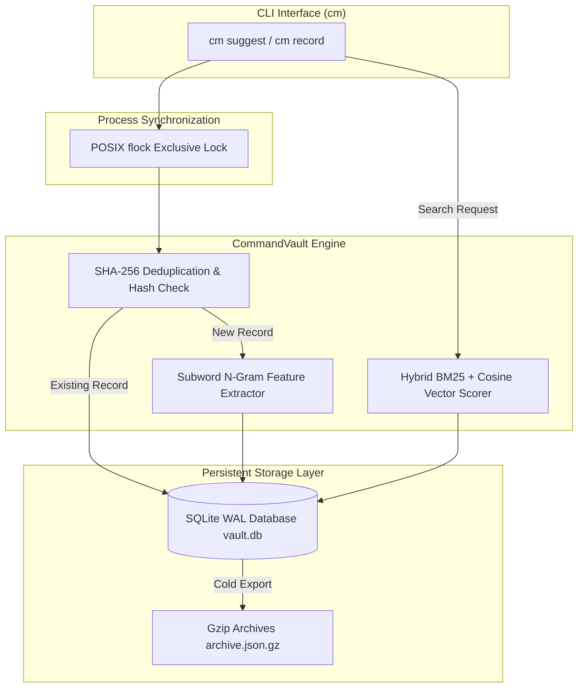

# cmd-vault ⚡

**Fast local CLI command history & winning methodology memory system for AI agents & developers.**

[](https://github.com/modus-znz/cmd-vault/actions)
[](https://opensource.org/licenses/MIT)
[](https://www.python.org/downloads/)
[](https://github.com/modus-znz/cmd-vault)

`cmd-vault` is a zero-dependency, pure Python stdlib engine designed to give AI agents and terminal power-users instant recall of complex CLI workflows, winning commands, and operational methodology patterns.

---

## Table of Contents

- [Problem](#problem)
- [Architecture](#architecture)
- [Quickstart](#quickstart)
- [Usage](#usage)
- [Configuration](#configuration)
  - [Suggesting Commands](#suggesting-commands)
  - [Recording Commands](#recording-commands)
  - [Searching Vault](#searching-vault)
  - [Deduplication & Archiving](#deduplication--archiving)
- [Testing](#testing)
- [Operations](#operations)
- [Design Decisions](#design-decisions)
- [Limitations](#limitations)
- [Roadmap](#roadmap)
- [Contributing](#contributing)
- [License](#license)

---

## Problem

Traditional shell history files (`~/.bash_history`, `~/.zsh_history`) fail modern developer workflows and autonomous AI agents:

1. **Lack of Context & Purpose**: Standard history captures raw command strings without descriptions, exit codes, or semantic metadata explaining *why* a command succeeded.
2. **Exponential Redundancy**: History files accumulate thousands of duplicate invocations (`ls`, `git status`, `cd ..`), bloating context windows and degrading recall performance.
3. **Keyword-Only Exact Matches**: Reverse history search (`Ctrl+R`) requires exact string matching, failing when users search by intent or partial concept (e.g., searching for "k8s pod list" when the command was `kubectl get pods`).
4. **No Process Synchronization**: Concurrent terminal sessions or parallel AI agents overwrite flat history files upon shell exit, losing valuable command sequences.

`cmd-vault` solves these problems by indexing commands in a transactional SQLite database with POSIX process locking, SHA-256 deduplication, frequency execution scoring, and hybrid BM25 + character n-gram semantic search.

---

## Architecture

The following diagram illustrates how `cmd-vault` orchestrates command recording, SQLite WAL indexing, hybrid semantic scoring, POSIX flock process synchronization, and gzip archive compression:



---

## Quickstart

### Installation

Clone the repository and install `cmd-vault` in editable mode or directly into your Python environment:

```bash
git clone https://github.com/modus-znz/cmd-vault.git
cd cmd-vault
pip install -e .
```

### Basic Verification

Verify installation by running `cm --version` or checking system stats:

```bash
cm audit
```

---

## Usage

### Suggesting Commands

Use `cm suggest` to query command memory using natural language keywords or partial intent:

```bash
cm suggest "run python tests with coverage"
```

Output:
```text
--- CMD-VAULT SUGGESTIONS (1 matches) ---
[1] pytest -v --cov=src - Run python tests with coverage
    Relevance Score: 64.91 | Executions: 3 | Category: command
```

For machine-readable JSON output:

```bash
cm suggest "kubernetes pod status" --json
```

### Recording Commands

Record commands and winning methodologies into vault memory:

```bash
cm record "docker compose up -d --build" \
  -d "Build and spin up container services in background" \
  -c "docker" \
  -t "containers,docker,dev" \
  -e 0
```

When recording identical commands multiple times, `cmd-vault` automatically detects the SHA-256 hash collision, increments the execution count (`usage_count`), and updates recency without duplicating data.

### Searching Vault

Search indexed commands with query ranking:

```bash
cm search "nginx service status"
```

### Deduplication & Archiving

Run an explicit sweep deduplication check across vault entries:

```bash
cm dedup
```

Export vault entries to a compressed Gzip JSON backup archive:

```bash
cm compress
```

---

## Configuration

Configure environment variables or default vault paths:

| Variable | Description | Default |
|---|---|---|
| `CMD_VAULT_PATH` | Path to SQLite WAL database file | `~/.cm/memory.db` |
| `CMD_VAULT_MAX_RESULTS` | Default number of search results returned | `5` |

---

## Testing

`cmd-vault` includes a comprehensive unit test suite utilizing Python's built-in `unittest` framework.

Run test discovery:

```bash
python3 -m unittest discover -s tests
```

Tests verify:
- SQLite WAL initialization & performance pragmas
- SHA-256 hash calculation and deduplication semantics
- Subword n-gram vector feature extraction and cosine scoring
- Gzip archive compression and decompression
- CLI entry points and JSON payload serialization

---

## Operations

### Maintenance & DB Tuning

`cmd-vault` automatically initializes SQLite with high-throughput pragmas:
- `PRAGMA journal_mode=WAL;` (Write-Ahead Logging for concurrency)
- `PRAGMA synchronous=NORMAL;` (Optimized fsync durability)
- `PRAGMA mmap_size=268435456;` (256MB memory mapping)

### Backup & Restore

To back up the vault state:
1. Run `cm compress` to generate a compressed snapshot in `~/.cmd_vault/archives/`.
2. Copy `~/.cmd_vault/vault.db` and associated WAL journal files.

---

## Design Decisions

- **Pure Python Stdlib Only**: Zero external dependencies ensures `cmd-vault` can be deployed instantly in minimal Docker containers, restricted enterprise environments, and lightweight AI agent sandboxes.
- **SQLite WAL Mode**: Provides fast concurrent read operations while AI agents or terminal scripts log commands in parallel.
- **SHA-256 Deduplication**: Guarantees deterministic identity for command strings regardless of execution frequency.
- **Character N-Gram Vector Similarity**: Enables subword and fuzzy matching without heavy machine learning dependencies (e.g. PyTorch, ONNX Runtime).

---

## Limitations

- **Single Host Scope**: `cmd-vault` is optimized for local process storage; distributed cluster synchronization requires external network transport.
- **PlainText Secrets Caution**: Sensitive tokens or passwords typed directly into commands will be indexed. Ensure secrets are managed via environment variables.

---

## Roadmap

- [ ] Shell integration hooks for Bash, Zsh, and Fish shells (`HISTFILE` auto-ingestion)
- [ ] Export format support for vector databases (ChromaDB, Qdrant)
- [ ] Remote agent sync protocol via SSH/rsync

---

## Contributing

Contributions are welcome! Please read [CONTRIBUTING.md](CONTRIBUTING.md) before submitting Pull Requests.

---

## License

This project is licensed under the MIT License - see the [LICENSE](LICENSE) file for details.
